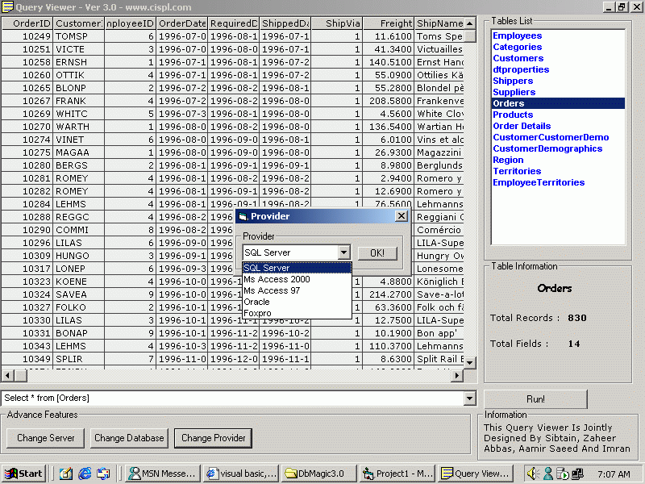



## Query Viewer 3\.0

### Description

Now Supports Oracle And Foxpro Too. Previous functions are still there!. Write the Query in the box just press enter and the result is there in the Grid Enjoy!!!. Please VOTE FOR THIS
 
### More Info
 

             |
---                |---
**Submitted On**   |2001-09-03 07:10:20
**By**             |[Sibtain Raza](https://github.com/Planet-Source-Code/PSCIndex/blob/master/ByAuthor/sibtain-raza.md)
**Level**          |Advanced
**User Rating**    |4.6 (60 globes from 13 users)
**Compatibility**  |VB 6\.0
**Category**       |[Complete Applications](https://github.com/Planet-Source-Code/PSCIndex/blob/master/ByCategory/complete-applications__1-27.md)
**World**          |[Visual Basic](https://github.com/Planet-Source-Code/PSCIndex/blob/master/ByWorld/visual-basic.md)
**Archive File**   |[Query View258019220\.zip](https://github.com/Planet-Source-Code/sibtain-raza-query-viewer-3-0__1-26921/archive/master.zip)

